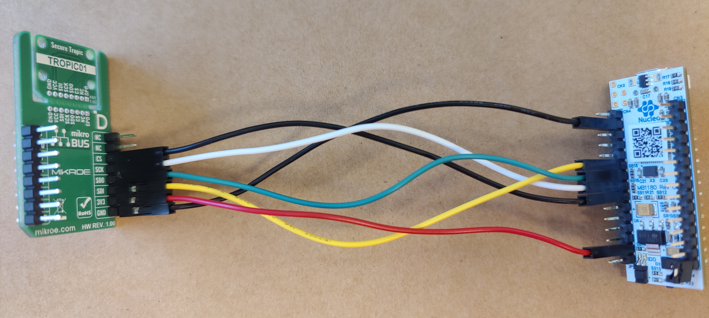

# Nucleo L432KC + TROPIC01 Arduino shield

 > [!WARNING]
 > L432KC example is no longer updated and it stays here only from historical reasons

This folder contains examples of libtropic's usage on [Nucleo L432KC](https://os.mbed.com/platforms/ST-Nucleo-L432KC/) ST Microelectronic's development board.

Contributors, please follow [guidelines](https://github.com/tropicsquare/libtropic-stm32/blob/master/CONTRIBUTING.md).

We don't provide shield for this board, example expects TROPIC01 to be wired to the following pins:
```
|------------|-----------------|-----------------|
|  TROPIC01  |  STM32L432KCU6  |  NUCLEO L432KC  |
|------------|-----------------|-----------------|
|  GND       |  GND            |  GND            |
|  3V3       |  3V3            |  3V3            |
|  MISO      |  GPIOA_PIN_6    |  A6             |
|  MOSI      |  GPIOA_PIN_7    |  A5             |
|  SCK       |  GPIOA_PIN_5    |  A4             |
|  CS        |  GPIOA_PIN_4    |  A3             |
|------------|-----------------|-----------------|
```


## Clone

This repository must be cloned recursively, because it contains submodules with libtropic SDK and STM32's drivers.

```bash
git clone https://github.com/tropicsquare/libtropic-stm32.git
cd libtropic-stm32
git submodule update --init --recursive
cd NUCLEO_L432KC/
```

## Dependencies and Requirements

You need to have:
* cmake (Could be installed with `sudo apt install cmake`)
* arm-none-eabi-gcc (Could be installed with `sudo apt install gcc-arm-none-eabi`)
* openocd (https://openocd.org/pages/getting-openocd.html)

# Build All Examples

All available examples are taken from [`libtropic`](https://github.com/tropicsquare/libtropic/tree/master/examples).

Build all examples in one place with following commands:

```bash
mkdir build
cd build
cmake -DLT_BUILD_EXAMPLES=1 ..
make
```
For each example, an ELF binary will be created in the build directory. Once all examples are built, continue with following chapter.

# Recommended First Steps

The Nucleo board provides a virtual serial port over USB. To view the output from the examples, connect to this serial port using a terminal emulator (e.g., `minicom`, `screen`, or PuTTY).

 > [!IMPORTANT]
 > Before you start with various examples, we strongly recommend to do two things first:
 > * Read CHIP ID and TROPIC01's firmware versions and **save printed output for future reference**
 > * Update TROPIC01's both internal firmware to latest version.

 > [!TIP]
 > If you want to do a quick connectivity check for example with 'Hello World' example, all elf binaries are available [here](https://github.com/tropicsquare/libtropic-stm32/actions/workflows/build_and_upload_examples.yml) (click on latest workflow run, scroll down to `Artifacts` and download an artifact for your board).

## Display And Save Chip ID And Fw Versions
To display actual versions of internal firmwares and details from CHIP ID data field, program and execute following example:
```bash
./flash.sh build/lt_ex_show_chip_id_and_fwver.elf
```

We recommend to save printed output for future reference.

## Update Internal Firmwares

To update both internal firmwares to latest versions program and execute following example:
```bash
./flash.sh build/lt_ex_fw_update.elf
```

After successfull execution your chip will contain latest firmwares and will be compatible with libtropic API.


## Building and Running Other Examples

> [!WARNING]
> Some examples causes irreversible changes to chip. For more detail read [`README.md`](https://github.com/tropicsquare/libtropic/tree/master/examples/).


For each built example, a binary was created in the build directory. For example, flash and execute the `lt_ex_hello_world` example as:
```bash
./flash.sh build/lt_ex_hello_world.elf
```
In your serial port you should see some output similar to this:
```bash
INFO    [  21] ======================================
INFO    [  22] ==== TROPIC01 Hello World Example ====
INFO    [  23] ======================================
INFO    [  27] Initializing handle
INFO    [  35] Starting Secure Session with key 0
INFO    [  43] 	-------------------------------------------------
INFO    [  46] Sending Ping command with message:
INFO    [  47] 	"This is Hello World message from TROPIC01!!"
INFO    [  55] 	-------------------------------------------------
INFO    [  57] Message received from TROPIC01:
INFO    [  58] 	"This is Hello World message from TROPIC01!!"
INFO    [  59] 	-------------------------------------------------
INFO    [  61] Aborting Secure Session
INFO    [  69] Deinitializing handle
```

> [!IMPORTANT]
> When `LT_BUILD_EXAMPLES` are set, there has to be a way to define the SH0 private key for the TROPIC01's pairing key slot 0, because both the examples and the tests depend on it. For this purpose, the CMake variable `LT_SH0_PRIV_PATH` is used, which should hold the path to the file with the SH0 private key in PEM or DER format. By default, the path is set to the currently used lab batch package, found in `libtropic/provisioning_data/<lab_batch_package_directory>/sh0_key_pair/`. But it can be overriden by the user either from the command line when executing CMake (switch `-DLT_SH0_PRIV_PATH=<path>`), or from a child CMakeLists.txt.

## Building Functional Tests

All available functional tests can be found [here](https://github.com/tropicsquare/libtropic/tree/master/tests/functional/).

> [!WARNING]
> Some tests make irreversible changes to the chip, such as writing pairing keys. Those irreversible
> tests contain `_ire_` in their name. On the other hand, reversible tests are marked `_rev_`
> and are generally safe to run, as they do only temporary changes and always do a clean up.

To build functional tests do the following:
```bash
mkdir build
cd build
cmake -DLT_BUILD_TESTS=1 ..
make
```

For each test, a binary will be created in the build directory, the same as when building examples.

> [!IMPORTANT]
> When `LT_BUILD_TESTS` are set, there has to be a way to define the SH0 private key for the TROPIC01's pairing key slot 0, because both the examples and the tests depend on it. For this purpose, the CMake variable `LT_SH0_PRIV_PATH` is used, which should hold the path to the file with the SH0 private key in PEM or DER format. By default, the path is set to the currently used lab batch package, found in `libtropic/provisioning_data/<lab_batch_package_directory>/sh0_key_pair/`. But it can be overriden by the user either from the command line when executing CMake (switch `-DLT_SH0_PRIV_PATH=<path>`), or from a child CMakeLists.txt.

We recommend to use CTest for handling of functional tests.

To show available tests:
```bash
ctest -N
```

To launch all tests (some of them are irreversible):
```bash
ctest
```

To launch a selected test:
```bash
ctest -R test_name
```

> [!TIP]
> To see all output use `--verbose`.


# FAQ

If you encounter any issue, please have a look [here](./../FAQ.md) before filling an issue here or before reaching out to our [support](https://support.desk.tropicsquare.com/).

